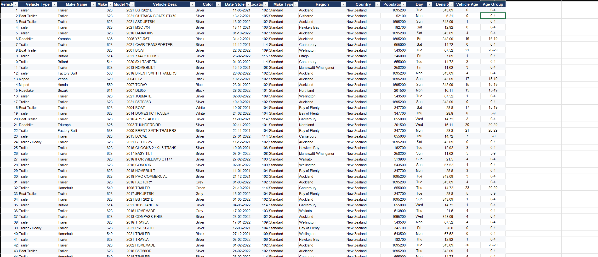
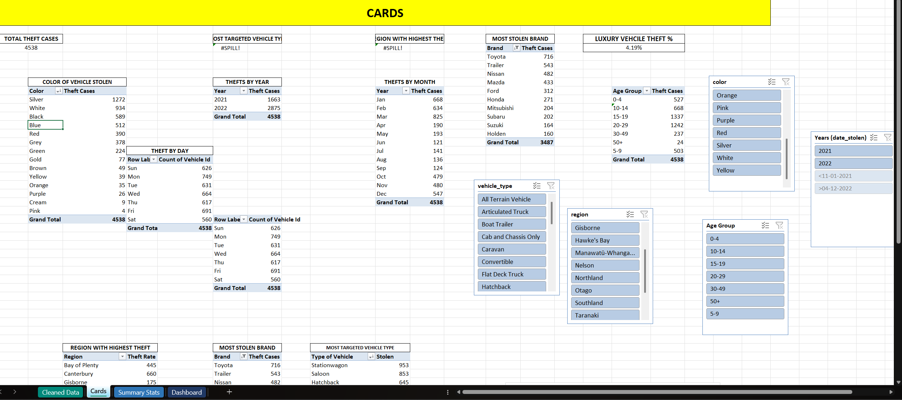
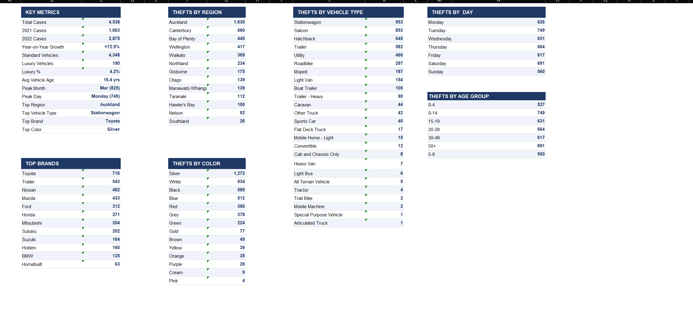
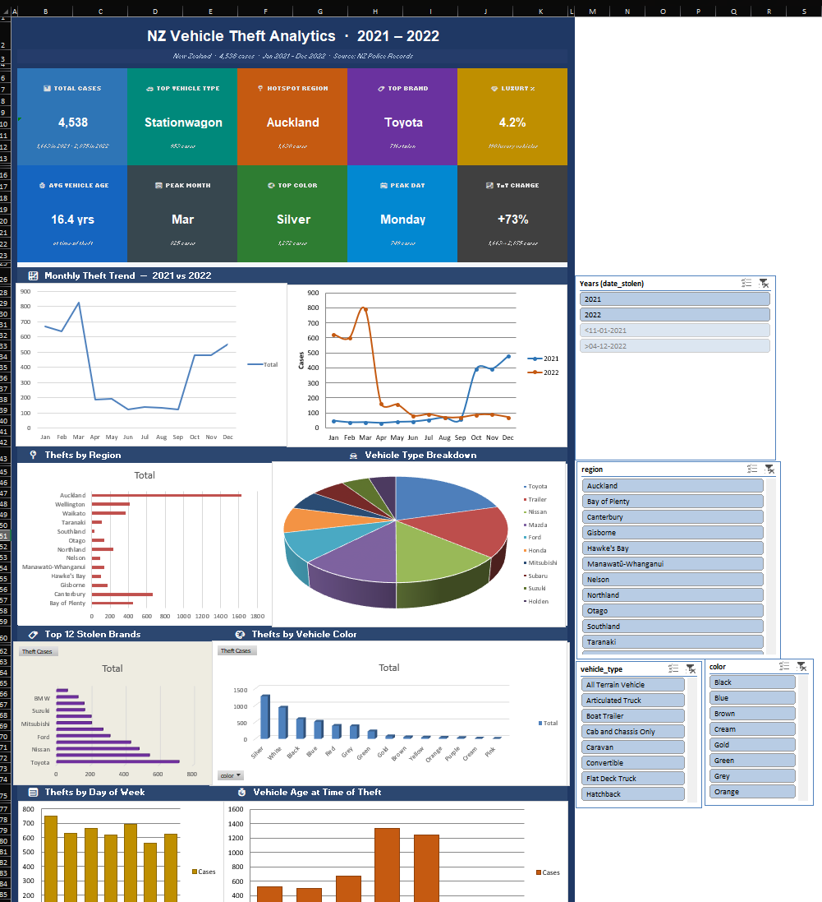

# NZ Vehicle Theft Analysis (2021–2022)

An end-to-end data analytics project examining **4,538 vehicle theft records** across New Zealand. Raw relational data was cleaned, joined, and analyzed entirely in Microsoft Excel — covering regional patterns, vehicle types, brands, colors, theft timing, and vehicle age.

---

## Project Overview

This project explores vehicle theft incidents reported to NZ Police between October 2021 and April 2022. Starting from three separate raw text files, the data was cleaned, joined into a single unified table, and analyzed using Excel's core analytical tools.

The goal was to surface actionable patterns: *Where do thefts concentrate? What vehicles are targeted? When do thefts happen?*

---

## Tools & Approach

| Tool | Role |
|---|---|
| **Microsoft Excel** | Data cleaning, table joins (VLOOKUP/XLOOKUP), Pivot Tables, Pivot Charts, KPI cards, slicers, formulas |
| **Claude AI** | Converted the completed Excel analysis into a standalone HTML dashboard for web presentation |

All data work — cleaning, joining, aggregating, and visualizing — was done manually in Excel. The HTML dashboard is an additional presentation layer generated after the analysis was complete.

---

## Dataset

Three raw relational text files were cleaned and joined in Excel:

| Table | Key Columns | Description |
|---|---|---|
| `stolen_vehicles` | `vehicle_id`, `vehicle_type`, `make_id`, `model_year`, `vehicle_desc`, `color`, `date_stolen`, `location_id` | Core theft records — one row per stolen vehicle |
| `make_details` | `make_id`, `make_name`, `make_type` | Brand lookup — Standard vs. Luxury classification |
| `locations` | `location_id`, `region`, `country`, `population`, `density` | NZ regional data for geographic mapping |

The three tables were joined on `make_id` and `location_id` using VLOOKUP/XLOOKUP. Three derived columns were added during analysis:

- `Day` — day of week extracted from `date_stolen`
- `Vehicle Age` — age of vehicle at time of theft
- `Age Group` — bucketed age ranges (0–4, 5–9, 10–14, etc.)

---

## Workbook Structure

The workbook (`EXCEL PROJECT.xlsx`) has 4 sheets:

### Sheet 1 — Cleaned Data
- **Purpose:** Single source of truth for all analysis
- **Contents:** All 4,538 records across 14 columns — original fields + derived columns (`Day`, `Vehicle Age`, `Age Group`)
- **Why it exists:** Provides the joined, cleaned base table that feeds every Pivot Table and chart in the workbook



---

### Sheet 2 — Cards
- **Purpose:** Raw Pivot Tables and slicers that power the KPI cards on the Dashboard
- **Contents:** Breakdowns by color, year, month, day, brand, vehicle type, region, age group, and luxury vehicle %
- **Why it exists:** Separates the data computation layer from the visual layer — keeping the Dashboard clean



---

### Sheet 3 — Summary Stats
- **Purpose:** Consolidated reference table of all key aggregations
- **Contents:** Key metrics, thefts by region, vehicle type, day, brand, color, and age group — all in one place
- **Why it exists:** Quick-reference companion to the Dashboard; useful for validating chart values



---

### Sheet 4 — Dashboard
- **Purpose:** Main visual output — interactive and presentation-ready
- **Contents:**
  - 10 KPI metric cards
  - Monthly theft trend (combined + year-over-year line chart)
  - Thefts by region (bar chart)
  - Vehicle type breakdown (doughnut chart)
  - Top 12 stolen brands (bar chart)
  - Thefts by color and by day of week
  - Vehicle age at time of theft
- **Why it exists:** Translates all analysis into a single interactive view; fully filterable via slicers (`Years`, `region`, `vehicle_type`, `color`)



---

## Key Insights

**Growth**
- Thefts rose from 1,663 (2021) to 2,875 (2022) — a **+73% year-on-year increase**
- Peak month: March 2022 with **825 cases**

**Geography**
- Auckland accounts for **1,630 cases (36%)** — more than double Canterbury (660), the next highest region
- Southland had the fewest thefts (26)

**Vehicle types**
- Top targets: Stationwagon (953), Saloon (853), Hatchback (645)
- Trailers (582) heavily targeted — likely due to minimal security
- Luxury vehicles: only **4.2%** of all thefts

**Brands**
- Toyota leads at **716 cases**, then Nissan (482), Mazda (433), Ford (312)
- Reflects prevalence on NZ roads rather than inherent vulnerability

**Vehicle age**
- Average stolen vehicle was **16.4 years old**
- Older vehicles (10–19 years) make up the largest theft cohort — fewer electronic immobilisers

**Color**
- Silver (1,272), White (934), Black (589) — distribution mirrors NZ's general vehicle population

**Timing**
- Monday is peak theft day (749 cases); Sunday is slowest (560)
- Spread is fairly even — consistent with opportunistic theft patterns

---

## HTML Dashboard

`nz_theft_dashboard.html` is a standalone interactive dashboard. Open it in any browser — no internet connection required.

> This file was generated by Claude AI as a web presentation layer on top of the completed Excel analysis. It was not manually coded.

Supports filtering by:
- Year (2021 / 2022 / All)
- Region
- Make type (Standard / Luxury)
- Vehicle type

---

## Files

```
├── EXCEL PROJECT.xlsx          # Full workbook — 4 sheets (see structure above)
├── nz_theft_dashboard.html     # Standalone interactive dashboard (open in browser)
├── cleaned_data.png            # Sheet 1 — unified joined table
├── cards.png                   # Sheet 2 — pivot tables and slicers
├── summary_stats.png           # Sheet 3 — aggregated reference tables
├── dashboard.png               # Sheet 4 — visual dashboard
└── README.md
```

---

## Notes

- Raw data was sourced as three separate relational text files: `stolen_vehicles`, `make_details`, `locations`
- All data cleaning, joining, and analysis was performed manually in Microsoft Excel
- The HTML dashboard was generated with Claude AI after the Excel analysis was complete — it serves as a web-friendly presentation layer, not a replacement for the workbook
